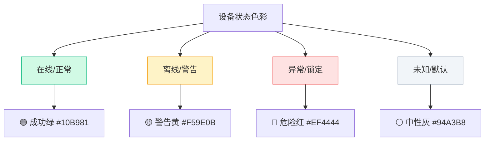
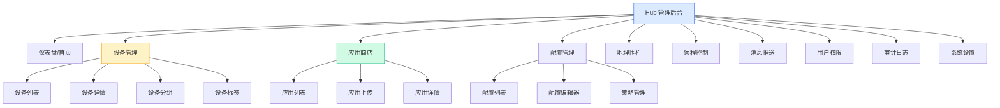
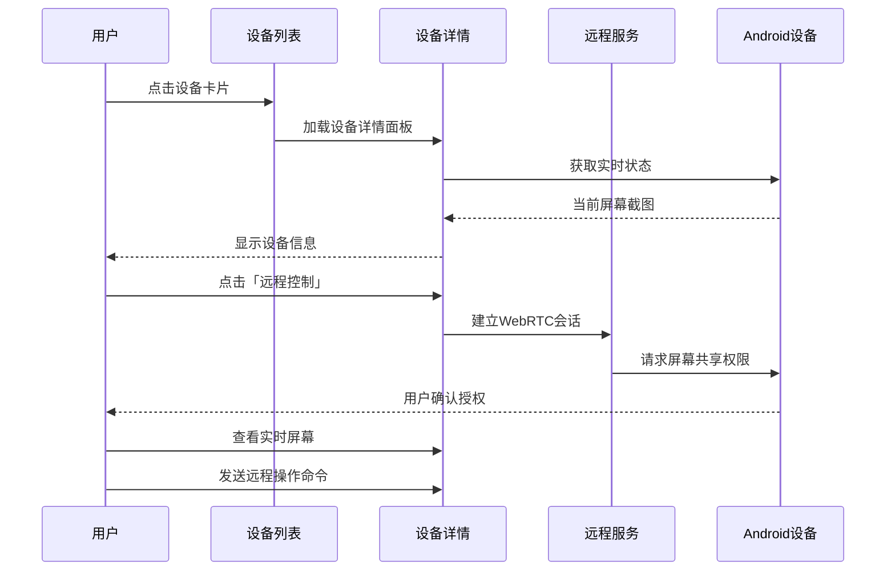
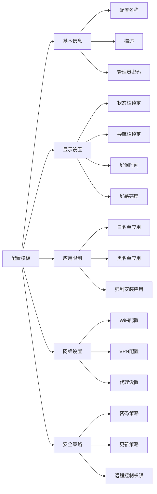
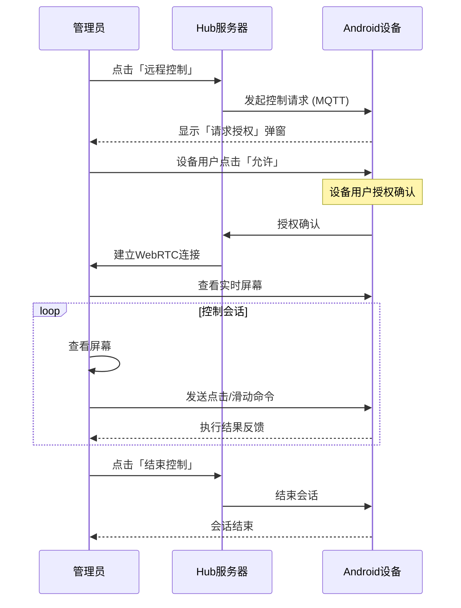
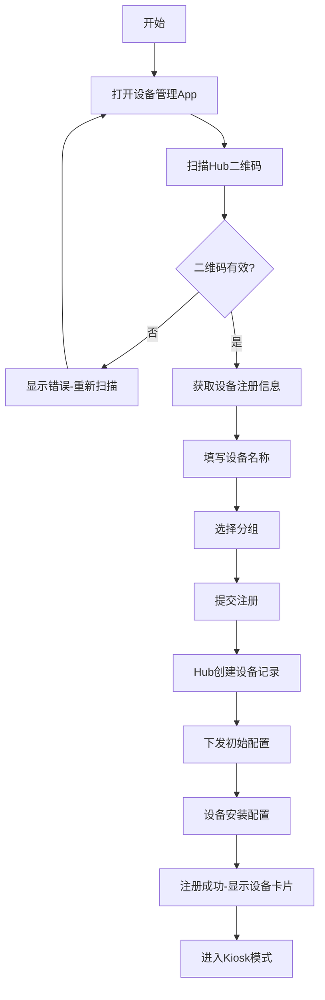
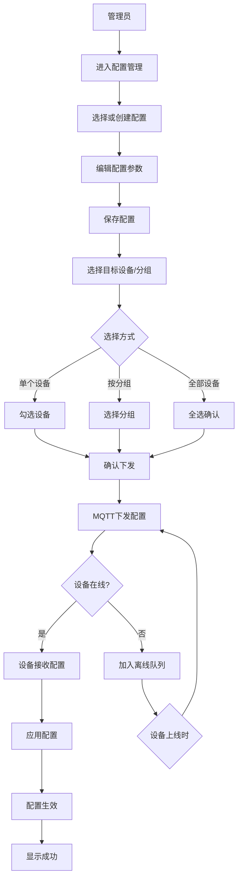
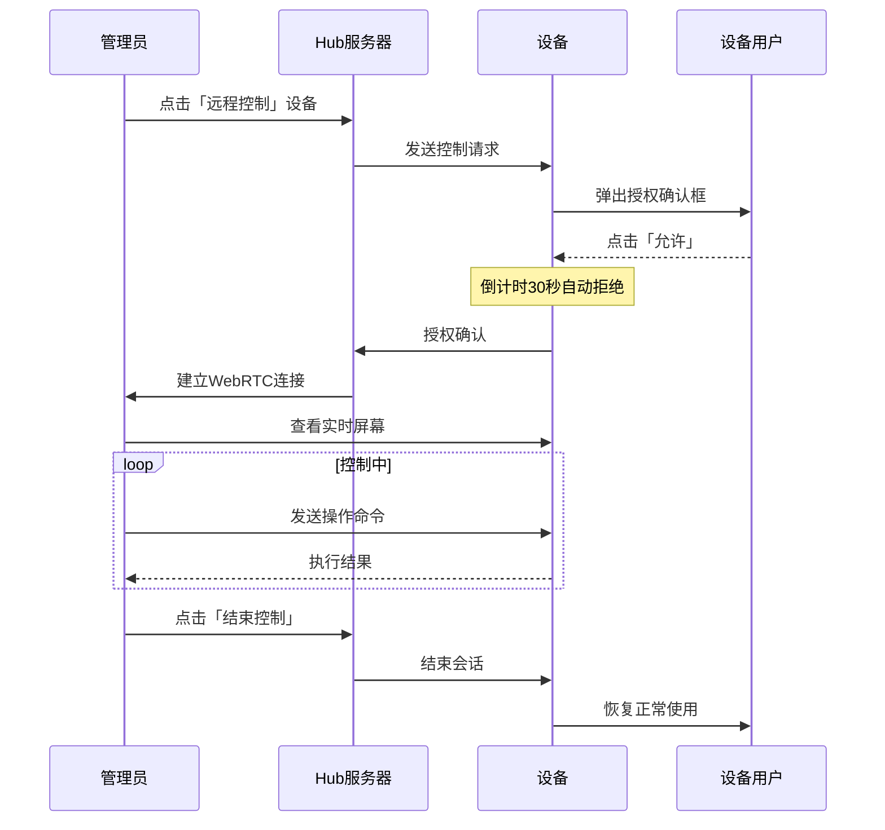
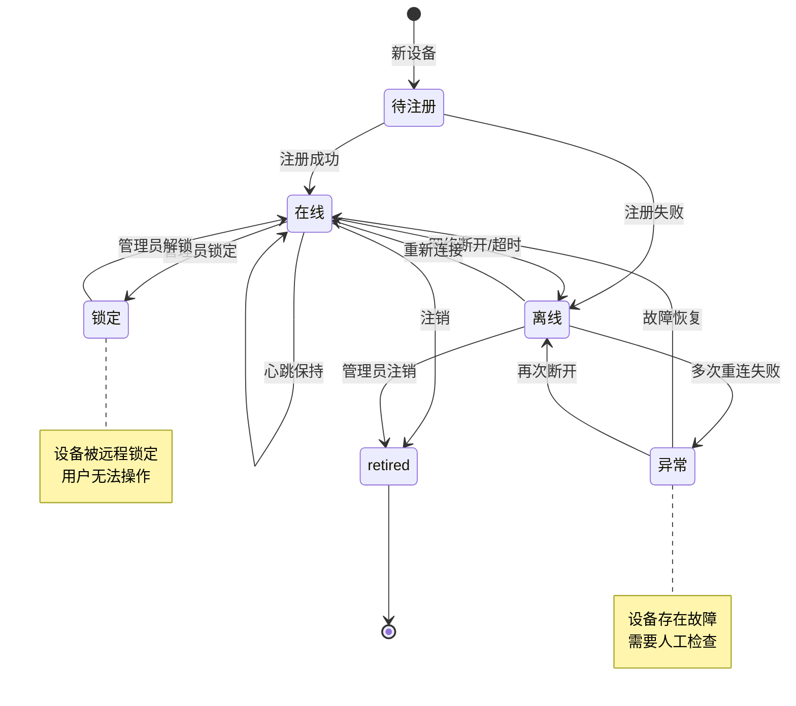

# FreeKiosk 企业版 MDM UI/UX 设计方案

## 文档信息
- **版本**: 1.0
- **日期**: 2026-03-24
- **范围**: Hub Web 端 + Android Pad 端
- **目标用户**: 中国企业管理员、K12教育机构教师/管理员

---

## 1. 产品概述与设计目标

### 1.1 目标用户画像

| 用户类型 | 典型场景 | 设计关注点 |
|---------|---------|-----------|
| 企业IT管理员 | 管理100+设备，批量配置 | 高效批量操作、清晰状态一览 |
| K12教师 | 课堂管理30台设备 | 简单直观、一键操作 |
| 学校运维 | 跨校区管理500+设备 | 多租户隔离、权限分级 |
| 巡检人员 | 室外移动设备管理 | 地图可视化、快速定位 |

### 1.2 设计目标

```
┌─────────────────────────────────────────────────────────────┐
│                     设计目标优先级                            │
├─────────────────────────────────────────────────────────────┤
│  1. 简单直观    │ 3步内完成任何操作    │ 核心指标          │
│  2. 中文友好    │ 全中文界面无歧义      │ 适配中国用户      │
│  3. 平板优先    │ 触控友好、大触摸目标  │ Pad场景优化      │
│  4. 效率至上    │ 批量操作、一览无余    │ 管理员效率        │
└─────────────────────────────────────────────────────────────┘
```

### 1.3 设计风格定位

**风格**: 科技感企业控制台 + 中国特色交互习惯
- 深色侧边栏 + 浅色内容区（减少视觉疲劳）
- 大卡片 + 大按钮（适配触控）
- 图标 + 文字双重标识（中文无歧义）
- 渐变色点缀（现代感但不过度）

---

## 2. 设计系统基础

### 2.1 色彩系统

#### 主色调 - 科技蓝

```css
:root {
  /* 主色 - 科技蓝 */
  --color-primary: #2563EB;          /* 主按钮、激活状态 */
  --color-primary-hover: #1D4ED8;    /* 悬停状态 */
  --color-primary-light: #DBEAFE;    /* 浅色背景 */
  --color-primary-dark: #1E40AF;     /* 深色强调 */

  /* 辅助色 - 靛蓝 */
  --color-secondary: #6366F1;       /* 次要操作 */
  --color-secondary-hover: #4F46E5;

  /* 成功色 - 翠绿 */
  --color-success: #10B981;          /* 在线、正常 */
  --color-success-light: #D1FAE5;
  --color-success-dark: #059669;

  /* 警告色 - 琥珀 */
  --color-warning: #F59E0B;          /* 注意、离线 */
  --color-warning-light: #FEF3C7;

  /* 危险色 - 玫红 */
  --color-error: #EF4444;           /* 错误、锁定 */
  --color-error-light: #FEE2E2;

  /* 信息色 - 天蓝 */
  --color-info: #0EA5E9;
  --color-info-light: #E0F2FE;

  /* 中性色 */
  --color-bg-page: #F8FAFC;        /* 页面背景 - 浅灰蓝 */
  --color-bg-card: #FFFFFF;         /* 卡片背景 */
  --color-bg-sidebar: #1E293B;      /* 侧边栏背景 - 深蓝灰 */
  --color-bg-sidebar-hover: #334155;/* 侧边栏悬停 */
  --color-text-primary: #1E293B;    /* 主文本 */
  --color-text-secondary: #64748B;   /* 次要文本 */
  --color-text-muted: #94A3B8;     /* 辅助文本 */
  --color-text-inverse: #F8FAFC;   /* 反色文本 */
  --color-border: #E2E8F0;         /* 边框 */
  --color-border-dark: #334155;    /* 深色边框 */
}
```

#### 语义色彩映射



### 2.2 字体系统

#### 中文优化字体栈

```css
/* 中文标题 - 思源黑体 Heavy */
@font-face {
  font-family: 'ChineseTitle';
  src: local('Source Han Sans CN Heavy'), local('Noto Sans CJK SC Bold');
  font-weight: 700;
}

/* 中文正文 - 思源黑体 Regular */
@font-face {
  font-family: 'ChineseBody';
  src: local('Source Han Sans CN'), local('Noto Sans CJK SC');
  font-weight: 400;
}

/* 数字/代码 - JetBrains Mono */
@font-face {
  font-family: 'Mono';
  src: local('JetBrains Mono'), local('SF Mono');
  font-weight: 400;
}
```

#### 字体使用规范

| 用途 | 字体 | 字号 | 字重 | 行高 |
|-----|------|-----|------|-----|
| 页面大标题 H1 | ChineseTitle | 28px | 700 | 1.3 |
| 卡片标题 H2 | ChineseTitle | 20px | 700 | 1.4 |
| 区块标题 H3 | ChineseTitle | 16px | 600 | 1.4 |
| 正文内容 | ChineseBody | 14px | 400 | 1.6 |
| 辅助说明 | ChineseBody | 12px | 400 | 1.5 |
| 按钮文字 | ChineseTitle | 14px | 600 | 1.0 |
| 表格表头 | ChineseTitle | 13px | 600 | 1.0 |
| 表格内容 | ChineseBody | 13px | 400 | 1.4 |
| 数字/IP | Mono | 14px | 500 | 1.4 |

### 2.3 间距系统

#### 基础间距单位 (4px)

```css
:root {
  --space-1: 4px;    /* 紧凑间距 */
  --space-2: 8px;    /* 小间距 */
  --space-3: 12px;   /* 中间距 */
  --space-4: 16px;   /* 标准间距 */
  --space-5: 20px;   /* 大间距 */
  --space-6: 24px;   /* 区块间距 */
  --space-8: 32px;   /* 大区块 */
  --space-10: 40px;  /* 页面边距 */
  --space-12: 48px;  /* 巨量间距 */
}
```

#### Pad 触控优化间距

```
桌面端: 最小点击目标 32x32px
平板端: 最小点击目标 48x48px (触屏友好)
       按钮高度 >= 48px
       列表项高度 >= 56px
       卡片内边距 >= 16px
```

### 2.4 圆角系统

| 元素类型 | 圆角大小 | CSS类 |
|---------|---------|-------|
| 按钮、输入框 | 8px | `rounded-lg` |
| 标签、徽章 | 6px | `rounded-md` |
| 头像、小图标 | 9999px | `rounded-full` |
| 卡片、面板 | 12px | `rounded-xl` |
| 模态框 | 16px | `rounded-2xl` |
| 底部导航栏 | 16px | `rounded-t-2xl` |

### 2.5 阴影系统

```css
/* 静止状态 - 轻柔阴影 */
--shadow-sm: 0 1px 2px 0 rgb(0 0 0 / 0.05);

/* 悬停状态 - 卡片悬停 */
--shadow-md: 0 4px 6px -1px rgb(0 0 0 / 0.1), 0 2px 4px -2px rgb(0 0 0 / 0.1);

/* 弹窗/-dropdown */
--shadow-lg: 0 10px 15px -3px rgb(0 0 0 / 0.1), 0 4px 6px -4px rgb(0 0 0 / 0.1);

/* 固定底部栏/Toasts */
--shadow-xl: 0 20px 25px -5px rgb(0 0 0 / 0.1), 0 8px 10px -6px rgb(0 0 0 / 0.1);

/* 深色元素阴影 - 侧边栏 */
--shadow-dark: 0 25px 50px -12px rgb(0 0 0 / 0.5);
```

---

## 3. 布局架构

### 3.1 整体页面布局

```mermaid
┌──────────────────────────────────────────────────────────────────────┐
│                        顶部导航栏 (64px)                              │
│  ┌──────┬────────────────────────────────────────────┬───────────┐  │
│  │      │                                            │           │  │
│  │      │                                            │           │  │
│  │ 侧边 │              主内容区域                     │  详情面板 │  │
│  │ 边栏 │           (max-w-7xl)                     │ (可选)    │  │
│  │      │                                            │           │  │
│  │ 240px│                                            │  400px    │  │
│  │      │                                            │           │  │
│  └──────┴────────────────────────────────────────────┴───────────┘  │
│                        固定底部操作栏 (72px, 可选)                   │
└──────────────────────────────────────────────────────────────────────┘
```

### 3.2 Hub 端页面结构



### 3.3 侧边栏设计 (深色主题)

```html
┌────────────────────────────────────┐
│  LOGO  FreeKiosk MDM              │
├────────────────────────────────────┤
│  📊 仪表盘                        │
│  ━━━━━━━━━━━━━━━━━━━━━━━━━━━━━━━ │
│  📱 设备管理                    ◀ │
│     ├─ 全部设备                  │
│     ├─ 在线设备                  │
│     ├─ 离线设备                  │
│     └─ 设备分组                  │
│  📦 应用管理                    ◀ │
│     ├─ 全部应用                  │
│     ├─ 已安装                    │
│     └─ 应用商店                  │
│  ⚙️ 配置管理                    ◀ │
│     ├─ 设备配置                  │
│     ├─ 应用配置                  │
│     └─ 策略                      │
│  📍 地理围栏                    ◀ │
│  🖥️ 远程控制                    ◀ │
│  💬 消息推送                    ◀ │
│  👥 用户权限                    ◀ │
│  📋 审计日志                    ◀ │
├────────────────────────────────────┤
│  ⚙️ 系统设置                      │
│  👤 管理员  admin@xxx.com        │
└────────────────────────────────────┘
```

**侧边栏交互规范:**
- 悬停: 背景色 `#334155`，左侧 3px 主色边条
- 激活: 背景色 `#334155`，左侧 3px 主色边条，文字白色
- 展开子菜单: 平滑高度过渡 200ms
- 收起: 点击其他地方或点击收起按钮

---

## 4. 核心页面设计

### 4.1 仪表盘 (Dashboard)

#### 页面布局 ASCII 示意

```
┌─────────────────────────────────────────────────────────────────────────┐
│ 仪表盘                                           2026年3月24日 14:30    │
├─────────────────────────────────────────────────────────────────────────┤
│                                                                         │
│  ┌─────────────┐ ┌─────────────┐ ┌─────────────┐ ┌─────────────┐      │
│  │ 📱 设备总数  │ │ 🟢 在线     │ │ 🟡 离线     │ │ 📦 应用数   │      │
│  │             │ │             │ │             │ │             │      │
│  │    1,234    │ │    1,089    │ │     145     │ │     58      │      │
│  │   全部设备   │ │   活跃中    │ │   待处理    │ │   已安装    │      │
│  │             │ │             │ │             │ │             │      │
│  │ ▲ +12%     │ │ ▲ +8%      │ │ ▼ -3%      │ │ ▲ +5%      │      │
│  └─────────────┘ └─────────────┘ └─────────────┘ └─────────────┘      │
│                                                                         │
│  ┌───────────────────────────────────────┐ ┌─────────────────────────┐  │
│  │         设备状态分布 (饼图)              │ │    7日设备活跃趋势      │  │
│  │                                       │ │    (折线图)            │  │
│  │      🟢 88% 在线                      │ │  ↑                     │  │
│  │      🟡 10% 离线                      │ │ 1200 ┤      ╭─╮       │  │
│  │      🔴 2% 异常                      │ │  800 ┤  ╭──╯  ╰──╮    │  │
│  │                                       │ │  400 ┤──╯        ╰──  │  │
│  │                                       │ │    0 ┼──────────────  │  │
│  │                                       │ │       一 二 三 四 五 六 │  │
│  └───────────────────────────────────────┘ └─────────────────────────┘  │
│                                                                         │
│  ┌─────────────────────────────────────────────────────────────────┐  │
│  │  最近活动                                                    更多 ▶  │  │
│  ├─────────────────────────────────────────────────────────────────┤  │
│  │  🟢 设备「初三2班-01」上线                          2分钟前    │  │
│  │  📱 设备「实验室-07」安装应用「钉钉」                5分钟前    │  │
│  │  ⚙️ 配置「标准Kiosk」已更新                          15分钟前   │  │
│  │  📍 设备「教学楼3-02」进入围栏「校园」              30分钟前   │  │
│  │  🔴 设备「操场-03」离线告警                          1小时前    │  │
│  └─────────────────────────────────────────────────────────────────┘  │
│                                                                         │
└─────────────────────────────────────────────────────────────────────────┘
```

#### 统计卡片组件规范

```css
/* 统计卡片 */
.stat-card {
  background: white;
  border-radius: 12px;
  padding: 20px 24px;
  box-shadow: var(--shadow-sm);
  border: 1px solid var(--color-border);
  transition: all 0.2s ease;
}

.stat-card:hover {
  box-shadow: var(--shadow-md);
  transform: translateY(-2px);
}

/* 数字展示 */
.stat-value {
  font-family: 'ChineseTitle';
  font-size: 36px;
  font-weight: 700;
  color: var(--color-text-primary);
  line-height: 1.2;
}

/* 趋势指示 */
.stat-trend-up {
  color: var(--color-success);
  font-size: 12px;
  font-weight: 600;
}

.stat-trend-down {
  color: var(--color-error);
  font-size: 12px;
  font-weight: 600;
}
```

### 4.2 设备管理页面

#### 设备列表页布局

```
┌─────────────────────────────────────────────────────────────────────────┐
│  设备管理                                         + 新增设备  批量操作 ▼  │
├─────────────────────────────────────────────────────────────────────────┤
│                                                                         │
│  🔍 搜索设备名称/编号/IMEI...          状态 ▼  分组 ▼  配置 ▼  筛选   │
│                                                                         │
│  ☑️ 全选   已选择 3 台设备                                                │
│  ┌─────────────────────────────────────────────────────────────────────┐│
│  │ ☐ │ 📱 设备名称    │ 状态 │ 分组   │ 配置    │ 位置    │ 操作      ││
│  ├───┼──────────────┼──────┼────────┼────────┼────────┼───────────┤│
│  │ ☐ │ 初三2班-01   │ 🟢   │ 初三2班 │ 标准K  │ 39.9.. │ 📍 🖥️ ✏️ ││
│  │ ☐ │ 实验室-07     │ 🟢   │ 实验室  │ 研学配 │ 39.9.. │ 📍 🖥️ ✏️ ││
│  │ ☑ │ 教学楼3-02   │ 🟡   │ 教学楼3 │ 标准K  │ —      │ 📍 🖥️ ✏️ ││
│  │ ☐ │ 操场-03      │ 🔴   │ 操场    │ —      │ —      │ 📍 🖥️ ✏️ ││
│  └─────────────────────────────────────────────────────────────────────┘│
│                                                                         │
│                          < 1 2 3 4 5 ... 50 >     显示 1-20 / 共 986  │
│                                                                         │
│  ┌─────────────────────────────────────────────────────────────────────┐│
│  │ 批量操作:                                                           ││
│  │ [锁定设备] [重启设备] [更改配置] [移动分组] [删除设备]                ││
│  └─────────────────────────────────────────────────────────────────────┘│
└─────────────────────────────────────────────────────────────────────────┘
```

#### 设备卡片模式 (可选视图切换)

```
┌─────────────────────────────────────────────────────────────────────────┐
│  视图: [列表] [卡片]                                                    │
├─────────────────────────────────────────────────────────────────────────┤
│                                                                         │
│  ┌─────────────┐  ┌─────────────┐  ┌─────────────┐  ┌─────────────┐  │
│  │ 初三2班-01  │  │ 实验室-07   │  │ 教学楼3-02  │  │ 操场-03     │  │
│  │ ━━━━━━━━━━ │  │ ━━━━━━━━━━ │  │ ━━━━━━━━━━ │  │ ━━━━━━━━━━ │  │
│  │ 🟢 在线     │  │ 🟢 在线     │  │ 🟡 离线     │  │ 🔴 异常     │  │
│  │             │  │             │  │             │  │             │  │
│  │ 分组: 初三2 │  │ 分组: 实验室│  │ 分组: 教学楼│  │ 分组: 操场 │  │
│  │ 配置: 标准K │  │ 配置: 研学配│  │ 配置: 标准K │  │ 配置: 未配置 │  │
│  │             │  │             │  │             │  │             │  │
│  │ 📍 查看     │  │ 📍 查看     │  │ 📍 查看     │  │ 📍 查看     │  │
│  │ 🖥️ 控制    │  │ 🖥️ 控制    │  │ 🖥️ 控制    │  │ 🖥️ 控制    │  │
│  └─────────────┘  └─────────────┘  └─────────────┘  └─────────────┘  │
│                                                                         │
└─────────────────────────────────────────────────────────────────────────┘
```

#### 设备详情页



**设备详情页布局:**

```
┌─────────────────────────────────────────────────────────────────────────┐
│  ← 返回设备列表    设备详情                              编辑设备 ✏️       │
├─────────────────────────────────────────────────────────────────────────┤
│                                                                         │
│  ┌─────────────────────────────┐  ┌─────────────────────────────────┐  │
│  │      设备头像/状态          │  │  基础信息                       │  │
│  │      ┌─────────┐           │  │                                 │  │
│  │      │  🖥️    │           │  │  设备名称: 初三2班-01           │  │
│  │      │  设备图 │           │  │  设备编号: FKD-2024-0301        │  │
│  │      │  片区   │           │  │  IMEI: 860855041234567         │  │
│  │      └─────────┘           │  │  型号: 华为MatePad SE          │  │
│  │                             │  │  系统: Android 12               │  │
│  │  🟢 在线 (5分钟前)          │  │  App版本: 2.3.1               │  │
│  │  剩余电量: 78%  🔋         │  │  分组: 初三2班                 │  │
│  │                             │  │  配置: 标准Kiosk配置           │  │
│  │  [锁定] [重启] [截图]       │  │                                 │  │
│  │  [远程控制] [发送消息]      │  │                                 │  │
│  └─────────────────────────────┘  └─────────────────────────────────┘  │
│                                                                         │
│  ┌─────────────────────────────────────────────────────────────────┐  │
│  │  📍 实时位置                              📱 应用 (12)  📋 配置     │  │
│  ├─────────────────────────────────────────────────────────────────┤  │
│  │                                                                  │  │
│  │              地图占位 - 显示设备当前位置                          │  │
│  │              [39.9042, 116.4074]                               │  │
│  │                                                                  │  │
│  │  最后定位: 2026-03-24 14:25:32                                │  │
│  │  [重新定位] [查看历史]                                          │  │
│  │                                                                  │  │
│  └─────────────────────────────────────────────────────────────────┘  │
│                                                                         │
│  ┌─────────────────────────────────────────────────────────────────┐  │
│  │  📋 操作日志                              加载更多 ▼              │  │
│  ├─────────────────────────────────────────────────────────────────┤  │
│  │  14:30  📍 进入围栏「校园」                          初三2班    │  │
│  │  14:25  📱 安装应用「钉钉」v7.0.3                   成功        │  │
│  │  14:20  🔄 重启设备                                   成功        │  │
│  │  14:15  🔒 锁定设备                                   成功        │  │
│  │  14:10  📍 GPS定位更新                                39.9...,   │  │
│  └─────────────────────────────────────────────────────────────────┘  │
│                                                                         │
└─────────────────────────────────────────────────────────────────────────┘
```

### 4.3 应用管理页面

#### 应用商店布局

```
┌─────────────────────────────────────────────────────────────────────────┐
│  应用管理                                         + 上传应用  同步应用     │
├─────────────────────────────────────────────────────────────────────────┤
│                                                                         │
│  分类: [全部] [系统] [社交] [教育] [工具] [企业]        搜索: 🔍 应用名 │
│                                                                         │
│  ┌─────────────────────────────────────────────────────────────────────┐│
│  │  ☐ │ 应用图标 │ 名称        │ 版本  │ 包名          │ 安装数 │ 操作 ││
│  ├───┼──────────┼────────────┼───────┼───────────────┼────────┼──────┤│
│  │ ☐ │ 📦      │ 钉钉       │ 7.0.3 │ com.lark     │  156   │ 安装  ││
│  │ ☐ │ 📦      │ 腾讯会议   │ 3.21  │ com.tencent..│   89   │ 安装  ││
│  │ ☐ │ 📦      │ 企业微信   │ 4.0.8 │ com.wechat..│  203   │ 安装  ││
│  │ ☐ │ 📦      │ 钉钉学习   │ 6.0.0 │ com.dingtalk │   67   │ 安装  ││
│  └─────────────────────────────────────────────────────────────────────┘│
│                                                                         │
│  [批量安装到设备] [批量卸载] [批量更新]                                   │
│                                                                         │
└─────────────────────────────────────────────────────────────────────────┘
```

#### 应用详情面板

```
┌────────────────────────────────────┐
│  应用详情                    [×]   │
├────────────────────────────────────┤
│  ┌──────┐  钉钉                │
│  │ 📦   │  DingTalk           │
│  │ 图标 │  版本: 7.0.3        │
│  └──────┘  包名: com.lark    │
│                                  │
│  分类: 社交                     │
│  安装设备数: 156 / 1000         │
│  ████████████░░░░ 15.6%       │
│                                  │
│  权限说明:                      │
│  ├ 📷 相机                     │
│  ├ 🎤 麦克风                   │
│  ├ 📍 位置信息                 │
│  └ 📁 存储权限                 │
│                                  │
│  描述:                         │
│  钉钉是阿里巴巴集团打造的...    │
│                                  │
│  ┌────────────────────────────────┐│
│  │ 安装到设备                     ││
│  │                                ││
│  │  选择分组: [初三2班    ▼]    ││
│  │  选择设备: [☑ 初三2班-01]    ││
│  │          [☑ 初三2班-02]    ││
│  │          [ ] 初三2班-03    ││
│  │                                ││
│  │  [取消]        [确认安装]     ││
│  └────────────────────────────────┘│
└────────────────────────────────────┘
```

### 4.4 配置管理页面

#### 配置编辑器



**配置编辑器布局:**

```
┌─────────────────────────────────────────────────────────────────────────┐
│  配置管理 → 编辑配置「标准Kiosk」                            保存配置    │
├─────────────────────────────────────────────────────────────────────────┤
│                                                                         │
│  ┌───────────────┬───────────────────────────────────────────────────┐ │
│  │ ▸ 基本信息    │                                                    │ │
│  │ ▸ 显示设置    │   配置名称: [标准Kiosk配置________________]        │ │
│  │ ▶ 应用限制  ← │   描述:    [用于标准教室设备配置_____________]      │ │
│  │ ▸ 网络设置    │                                                    │ │
│  │ ▸ 安全策略    │   管理员密码: [******] [显示/隐藏]                │ │
│  │               │                                                    │ │
│  │               │   ───────────────────────────────────────────    │ │
│  │               │                                                    │ │
│  │               │   ☑ 锁定状态栏                                    │ │
│  │               │   ☑ 锁定导航栏                                    │ │
│  │               │   ☑ 禁用截图功能                                  │ │
│  │               │                                                    │ │
│  │               │   屏保时间: [15分钟 ▼]                            │ │
│  │               │   屏幕亮度: [────────●──────] 70%                │ │
│  │               │                                                    │ │
│  └───────────────┴───────────────────────────────────────────────────┘ │
│                                                                         │
│  ┌─────────────────────────────────────────────────────────────────┐  │
│  │  ☑ 启用应用白名单                                               │  │
│  │                                                                 │  │
│  │  已允许的应用:                                                   │  │
│  │  ┌─────────────────────────────────────────────────────────┐  │  │
│  │  │ 📦 钉钉    │ 📦 腾讯会议 │ 📦 企业微信 │ [+ 添加应用] │  │  │
│  │  └─────────────────────────────────────────────────────────┘  │  │
│  └─────────────────────────────────────────────────────────────────┘  │
│                                                                         │
│  ┌─────────────────────────────────────────────────────────────────┐  │
│  │  设备分组分配:                                                  │  │
│  │                                                                 │  │
│  │  [☑ 初三2班] [☑ 实验室] [ ] 操场] [ ] 教学楼3]                 │  │
│  │                                                                 │  │
│  │  当前使用此配置的设备: 89 台                                     │  │
│  └─────────────────────────────────────────────────────────────────┘  │
│                                                                         │
└─────────────────────────────────────────────────────────────────────────┘
```

### 4.5 地理围栏页面

#### 围栏地图视图

```
┌─────────────────────────────────────────────────────────────────────────┐
│  地理围栏                              + 创建围栏  [地图视图] [列表视图]  │
├─────────────────────────────────────────────────────────────────────────┤
│                                                                         │
│  ┌─────────────────────────────────────────┐ ┌─────────────────────────┐│
│  │                                         │ │ 围栏列表               ││
│  │           地图区域                       │ ├─────────────────────────┤│
│  │                                         │ │ ━━━━━━━━━━━━━━━━━━━━━  ││
│  │      ╭──────────────╮                   │ │ 📍 校园围栏     🟢活跃 ││
│  │     ╱                ╲                  │ │    半径: 500m          ││
│  │    │    🏫 校园     │ ←围栏区域        │ │    设备: 45台         ││
│  │     ╲              ╱                   │ │    [查看] [编辑] [删除]││
│  │      ╰─────────────╯                   │ ├─────────────────────────┤│
│  │                                         │ │ ━━━━━━━━━━━━━━━━━━━━━  ││
│  │   📱 初三2班-01  在围栏内              │ │ 📍 教学楼围栏   🟢活跃 ││
│  │   📱 实验室-07   在围栏内              │ │    半径: 200m          ││
│  │   📱 操场-03     在围栏外 ⚠️           │ │    设备: 12台         ││
│  │                                         │ │    [查看] [编辑] [删除]││
│  │                                         │ ├─────────────────────────┤│
│  │   [+] [放大] [缩小] [定位] [围栏列表]  │ │ ━━━━━━━━━━━━━━━━━━━━━  ││
│  │                                         │ │ 📍 操场围栏     🟡暂停 ││
│  └─────────────────────────────────────────┘ │    半径: 100m          ││
│                                               │    设备: 8台          ││
│  ┌─────────────────────────────────────────┐ │    [查看] [编辑] [删除]││
│  │ 围栏详情: 校园围栏                       │ └─────────────────────────┘│
│  │ 状态: 🟢 围栏内 45 台 / 围栏外 3 台    │                         │
│  │ [查看进入/离开记录] [重新同步设备位置]     │                         │
│  └─────────────────────────────────────────┘                         │
│                                                                         │
└─────────────────────────────────────────────────────────────────────────┘
```

### 4.6 远程控制页面

#### 远程控制会话



**远程控制界面:**

```
┌─────────────────────────────────────────────────────────────────────────┐
│  远程控制 - 初三2班-01                                   [结束控制]    │
├─────────────────────────────────────────────────────────────────────────┤
│                                                                         │
│  ┌─────────────────────────────────────────────┐ ┌─────────────────────┐│
│  │                                             │ │ 设备信息            ││
│  │                                             │ │                     ││
│  │              设备屏幕画面                    │ │ 设备: 初三2班-01   ││
│  │              (实时同步)                     │ │ 系统: Android 12   ││
│  │                                             │ │ 屏幕: 1920x1200   ││
│  │                                             │ │                     ││
│  │                                             │ ├─────────────────────┤│
│  │                                             │ │ 连接状态: 🟢 流畅  ││
│  │                                             │ │ 延迟: 45ms         ││
│  │                                             │ │ 帧率: 25fps       ││
│  │                                             │ │                     ││
│  └─────────────────────────────────────────────┘ │ [📍 定位] [📷 截图]││
│                                                 │                     ││
│  ┌─────────────────────────────────────────────┐ │ [⌨ 虚拟键盘]       ││
│  │  🖱️  点击模式  │  ✋ 手势模式  │  ⌨ 键盘模式 │ │                     ││
│  ├─────────────────────────────────────────────┤ │ [发送快捷命令]      ││
│  │                                             │ │ ├─ 主页            ││
│  │  点击设备屏幕上的任意位置进行远程操作          │ │ ├─ 返回            ││
│  │                                             │ │ ├─ 最近任务        ││
│  │  支持: 单指点击 / 双指滑动 / 长按            │ │ └─ 电源菜单        ││
│  │                                             │ │                     ││
│  └─────────────────────────────────────────────┘ └─────────────────────┘│
│                                                                         │
│  ⚠️ 提示: 此操作将被记录在审计日志中                                     │
│                                                                         │
└─────────────────────────────────────────────────────────────────────────┘
```

---

## 5. 组件库规范

### 5.1 按钮组件

#### 主按钮 (Primary Button)

```html
<!-- 大触控按钮 (Pad优先) -->
<button class="btn btn-primary h-12 min-h-12 px-6 text-base font-semibold gap-2">
  <svg class="w-5 h-5"><!-- 图标 --></svg>
  <span>主要操作</span>
</button>

<!-- 中等按钮 (桌面) -->
<button class="btn btn-primary h-10 min-h-10 px-4 text-sm font-semibold gap-2">
  <span>主要操作</span>
</button>

<!-- 小型按钮 (表格内) -->
<button class="btn btn-primary btn-sm h-8 min-h-8 px-3 text-xs gap-1">
  <span>操作</span>
</button>
```

#### 按钮状态

| 状态 | 样式 | 用途 |
|-----|------|-----|
| Default | `btn-primary` | 默认状态 |
| Hover | 颜色加深 10% | 悬停反馈 |
| Active | 颜色加深 15% + scale(0.98) | 点击反馈 |
| Disabled | `btn-disabled opacity-50` | 不可点击 |
| Loading | `btn-disabled` + 旋转图标 | 处理中 |

### 5.2 输入框组件

```html
<!-- 标准输入框 -->
<div class="form-control w-full max-w-xs">
  <label class="label">
    <span class="label-text">设备名称</span>
    <span class="label-text-alt text-error">必填</span>
  </label>
  <input
    type="text"
    placeholder="请输入设备名称"
    class="input input-bordered h-12 text-base"
  />
  <label class="label">
    <span class="label-text-alt text-error">名称不能为空</span>
  </label>
</div>

<!-- 搜索框 -->
<div class="join w-full max-w-md">
  <div class="join-item flex items-center px-3 bg-base-200">
    <svg class="w-5 h-5 text-base-content/50"><!-- 搜索图标 --></svg>
  </div>
  <input
    type="text"
    placeholder="搜索设备名称/编号/IMEI..."
    class="input input-bordered join-item flex-1 h-12 text-base"
  />
  <button class="btn join-item h-12">搜索</button>
</div>
```

### 5.3 卡片组件

#### 设备卡片

```html
<div class="card bg-white shadow-sm border border-slate-100 hover:border-primary/30 hover:shadow-md transition-all cursor-pointer">
  <div class="card-body p-4">
    <!-- 卡片头部 -->
    <div class="flex items-start justify-between mb-3">
      <div class="flex items-center gap-3">
        <div class="w-12 h-12 rounded-xl bg-primary/10 flex items-center justify-center">
          <span class="text-xl font-bold text-primary">A</span>
        </div>
        <div>
          <h3 class="font-bold text-slate-800">设备名称</h3>
          <p class="text-xs text-slate-400">分组名称</p>
        </div>
      </div>
      <div class="badge badge-success gap-1">
        <span class="w-2 h-2 rounded-full bg-success"></span>
        在线
      </div>
    </div>

    <!-- 卡片内容 -->
    <div class="grid grid-cols-2 gap-2 text-xs mb-3">
      <div class="text-slate-500">型号: <span class="text-slate-700">华为MatePad</span></div>
      <div class="text-slate-500">电量: <span class="text-slate-700">78%</span></div>
      <div class="text-slate-500">最后活动: <span class="text-slate-700">5分钟前</span></div>
      <div class="text-slate-500">配置: <span class="text-slate-700">标准配置</span></div>
    </div>

    <!-- 卡片操作 -->
    <div class="flex gap-2">
      <button class="btn btn-ghost btn-sm flex-1 gap-1">
        <svg class="w-4 h-4"><!-- 定位图标 --></svg>
        定位
      </button>
      <button class="btn btn-ghost btn-sm flex-1 gap-1">
        <svg class="w-4 h-4"><!-- 控制图标 --></svg>
        控制
      </button>
      <button class="btn btn-ghost btn-sm btn-square">
        <svg class="w-4 h-4"><!-- 更多图标 --></svg>
      </button>
    </div>
  </div>
</div>
```

### 5.4 表格组件

```html
<div class="overflow-x-auto">
  <table class="table">
    <!-- 表头 -->
    <thead>
      <tr class="bg-base-200">
        <th class="w-12">
          <label>
            <input type="checkbox" class="checkbox checkbox-primary checkbox-sm" />
          </label>
        </th>
        <th class="text-base font-semibold">设备名称</th>
        <th class="text-base font-semibold">状态</th>
        <th class="text-base font-semibold">分组</th>
        <th class="text-base font-semibold">配置</th>
        <th class="text-base font-semibold">最后活动</th>
        <th class="text-base font-semibold text-right">操作</th>
      </tr>
    </thead>

    <!-- 表体 -->
    <tbody>
      <tr class="hover:bg-base-100 transition-colors">
        <th>
          <label>
            <input type="checkbox" class="checkbox checkbox-primary checkbox-sm" />
          </label>
        </th>
        <td>
          <div class="flex items-center gap-3">
            <div class="w-10 h-10 rounded-lg bg-primary/10 flex items-center justify-center font-bold text-primary">
              初
            </div>
            <div>
              <div class="font-semibold">初三2班-01</div>
              <div class="text-xs text-slate-400">FKD-2024-0301</div>
            </div>
          </div>
        </td>
        <td>
          <div class="badge badge-success gap-1">
            <span class="w-2 h-2 rounded-full bg-success"></span>
            在线
          </div>
        </td>
        <td>初三2班</td>
        <td>标准配置</td>
        <td>5分钟前</td>
        <td class="text-right">
          <div class="flex gap-1 justify-end">
            <button class="btn btn-ghost btn-sm btn-square" title="定位">
              <svg class="w-4 h-4"><!-- 定位图标 --></svg>
            </button>
            <button class="btn btn-ghost btn-sm btn-square" title="远程控制">
              <svg class="w-4 h-4"><!-- 控制图标 --></svg>
            </button>
            <button class="btn btn-ghost btn-sm btn-square" title="更多">
              <svg class="w-4 h-4"><!-- 更多图标 --></svg>
            </button>
          </div>
        </td>
      </tr>
    </tbody>
  </table>
</div>
```

### 5.5 模态框组件

```html
<!-- 确认删除模态框 -->
<div class="modal modal-open">
  <div class="modal-box max-w-md">
    <button class="btn btn-sm btn-circle btn-ghost absolute right-2 top-2">✕</button>

    <div class="flex items-center gap-3 mb-4">
      <div class="w-12 h-12 rounded-full bg-error/10 flex items-center justify-center">
        <svg class="w-6 h-6 text-error" fill="none" viewBox="0 0 24 24" stroke="currentColor">
          <path stroke-linecap="round" stroke-linejoin="round" stroke-width="2" d="M12 9v2m0 4h.01m-6.938 4h13.856c1.54 0 2.502-1.667 1.732-3L13.732 4c-.77-1.333-2.694-1.333-3.464 0L3.34 16c-.77 1.333.192 3 1.732 3z" />
        </svg>
      </div>
      <div>
        <h3 class="text-lg font-bold">确认删除设备</h3>
        <p class="text-sm text-slate-500">此操作不可恢复</p>
      </div>
    </div>

    <p class="py-4">
      确定要删除设备 <span class="font-semibold text-error">「初三2班-01」</span> 吗？设备将无法再接收任何指令。
    </p>

    <div class="modal-action">
      <button class="btn btn-ghost">取消</button>
      <button class="btn btn-error">确认删除</button>
    </div>
  </div>
  <div class="modal-backdrop bg-black/50"></div>
</div>
```

### 5.6 Toast 通知组件

```html
<!-- 成功通知 -->
<div class="toast toast-end">
  <div class="alert alert-success text-white shadow-xl">
    <svg class="w-6 h-6 shrink-0" fill="none" viewBox="0 0 24 24" stroke="currentColor">
      <path stroke-linecap="round" stroke-linejoin="round" stroke-width="2" d="M9 12l2 2 4-4m6 2a9 9 0 11-18 0 9 9 0 0118 0z" />
    </svg>
    <span class="font-semibold">设备锁定成功</span>
    <button class="btn btn-ghost btn-xs btn-circle">
      <svg class="w-4 h-4" fill="none" viewBox="0 0 24 24" stroke="currentColor">
        <path stroke-linecap="round" stroke-linejoin="round" stroke-width="2" d="M6 18L18 6M6 6l12 12" />
      </svg>
    </button>
  </div>
</div>

<!-- 错误通知 -->
<div class="toast toast-end">
  <div class="alert alert-error text-white shadow-xl">
    <svg class="w-6 h-6 shrink-0" fill="none" viewBox="0 0 24 24" stroke="currentColor">
      <path stroke-linecap="round" stroke-linejoin="round" stroke-width="2" d="M10 14l2-2m0 0l2-2m-2 2l-2-2m2 2l2 2m7-2a9 9 0 11-18 0 9 9 0 0118 0z" />
    </svg>
    <span class="font-semibold">命令发送失败：设备离线</span>
    <button class="btn btn-ghost btn-xs btn-circle">
      <svg class="w-4 h-4" fill="none" viewBox="0 0 24 24" stroke="currentColor">
        <path stroke-linecap="round" stroke-linejoin="round" stroke-width="2" d="M6 18L18 6M6 6l12 12" />
      </svg>
    </button>
  </div>
</div>
```

---

## 6. 用户流程图

### 6.1 设备注册流程



### 6.2 批量配置下发流程



### 6.3 远程控制流程



---

## 7. 响应式设计规范

### 7.1 断点定义

| 设备类型 | 宽度范围 | 布局策略 |
|---------|---------|---------|
| 手机 | < 640px | 单列堆叠，底部Tab导航 |
| 平板竖屏 | 640px - 768px | 双栏，侧边栏收起 |
| 平板横屏 | 768px - 1024px | 标准布局，完整侧边栏 |
| 桌面 | > 1024px | 宽屏优化，更多信息密度 |

### 7.2 Pad触控优化

```css
/* 触控设备优化 */
@media (pointer: coarse) {
  /* 增大所有可点击元素的最小尺寸 */
  .btn {
    min-height: 48px;
    min-width: 48px;
  }

  /* 表格行增加触控区域 */
  .table tbody tr {
    min-height: 56px;
  }

  /* 列表项增加内边距 */
  .list-item {
    padding: 16px;
  }

  /* 下拉菜单增加触控区域 */
  .dropdown-content a,
  .dropdown-content button {
    min-height: 44px;
    padding: 12px 16px;
  }
}
```

### 7.3 关键布局响应式策略

```
桌面 (≥1024px)                    平板横屏 (768-1024px)
┌────────────────────────────┐      ┌────────────────────────────┐
│ 侧边栏 │ 主内容      │详情│      │ 侧边栏 │ 主内容              │
│ 240px  │ flex-1    │400px│      │ 200px  │ flex-1            │
│        │            │     │      │        │                   │
│        │            │     │      │        │                   │
│        │            │     │      │        │                   │
└────────────────────────────┘      └────────────────────────────┘

平板竖屏 (640-768px)               手机 (<640px)
┌────────────────────────────┐      ┌────────────────────────────┐
│ 顶部导航栏                  │      │ 顶部导航栏                │
│ ━━━━━━━━━━━━━━━━━━━━━━━━  │      │ ━━━━━━━━━━━━━━━━━━━━━━━━  │
│                            │      │                            │
│ ┌────────────────────────┐│      │ ┌────────────────────────┐│
│ │     主内容 (单列)       ││      │ │     主内容 (单列)       ││
│ │                        ││      │ │                        ││
│ │                        ││      │ │                        ││
│ │                        ││      │ │                        ││
│ └────────────────────────┘│      │ └────────────────────────┘│
│                            │      │                            │
│ [底部Tab导航]              │      │ [底部Tab导航]              │
└────────────────────────────┘      └────────────────────────────┘
```

---

## 8. 交互规范

### 8.1 手势支持 (Pad)

| 手势 | 动作 | 适用场景 |
|-----|------|---------|
| 单指点击 | 选择/确认 | 所有按钮、列表项 |
| 单指滑动 | 滚动页面 | 页面、列表、卡片 |
| 双指捏合 | 缩放 | 地图、截图预览 |
| 双指滑动 | 滚动地图 | 地图视图 |
| 长按 | 显示上下文菜单 | 设备卡片、表格行 |
| 左滑 | 显示快捷操作 | 列表项操作 |

### 8.2 动画时长规范

| 动画类型 | 时长 | 缓动函数 |
|---------|------|---------|
| 微交互 (hover, focus) | 150ms | ease-out |
| 展开/收起 | 200ms | ease-in-out |
| 页面切换 | 300ms | ease-in-out |
| 模态框弹出 | 250ms | cubic-bezier(0.18, 0.89, 0.32, 1.28) |
| Toast 通知 | 400ms | cubic-bezier(0.18, 0.89, 0.32, 1.28) |
| 加载状态 | 持续 | - |

### 8.3 键盘快捷键

| 快捷键 | 动作 | 适用场景 |
|-------|------|---------|
| `Ctrl/Cmd + F` | 聚焦搜索框 | 全局 |
| `Esc` | 关闭弹窗/取消 | 模态框、菜单 |
| `Enter` | 确认操作 | 表单、确认框 |
| `↑/↓` | 导航列表 | 下拉菜单、表格 |
| `Space` | 选中/取消选中 | 列表项、复选框 |

---

## 9. 状态设计

### 9.1 设备状态



### 9.2 命令状态

| 状态 | 颜色 | 说明 |
|-----|------|-----|
| 待发送 | 灰色 | 命令等待发送 |
| 发送中 | 蓝色 | 命令正在发送 |
| 已送达 | 青色 | 命令已到达设备 |
| 执行中 | 黄色 | 设备正在执行 |
| 执行成功 | 绿色 | 命令执行成功 |
| 执行失败 | 红色 | 命令执行失败 |
| 超时 | 橙色 | 命令执行超时 |

---

## 10. 国际化说明

### 10.1 中文友好设计原则

1. **标签完整性**: 所有按钮、提示必须中文，无歧义
   - ✅ "保存配置" / "取消"
   - ❌ "Confirm" / "Cancel"

2. **单位标注**: 数字后紧跟单位
   - ✅ "1,234 台设备"
   - ✅ "78% 电量"

3. **时间友好**: 使用相对时间 + 具体时间
   - ✅ "5分钟前 (14:30)"
   - ✅ "今天 14:30"

4. **状态明确**: 使用颜色 + 图标 + 文字三重标识
   - ✅ "🟢 在线" / "🟡 离线" / "🔴 异常"

### 10.2 i18n 翻译键规范

```go
// 翻译键命名规范: {page}.{component}.{element}.{state}
// 示例
"device.list.title"          // 设备列表页面标题
"device.list.search.placeholder" // 搜索框占位符
"device.list.status.online"  // 在线状态
"device.list.action.lock"    // 锁定操作
```

---

## 11. 无障碍设计

### 11.1 色彩对比度

| 文本类型 | 最小对比度 | 示例颜色组合 |
|---------|-----------|-------------|
| 大文本 (≥18px) | 3:1 | #1E293B on #FFFFFF |
| 常规文本 (<18px) | 4.5:1 | #64748B on #FFFFFF |
| UI组件和图形 | 3:1 | 边框、图标 |

### 11.2 ARIA 规范

```html
<!-- 按钮 -->
<button
  role="button"
  aria-label="锁定设备"
  aria-pressed="false"
>
  🔒 锁定
</button>

<!-- 状态徽章 -->
<span
  class="badge badge-success"
  role="status"
  aria-label="设备在线"
>
  🟢 在线
</span>

<!-- 进度指示 -->
<div
  role="progressbar"
  aria-valuenow="75"
  aria-valuemin="0"
  aria-valuemax="100"
  aria-label="安装进度"
>
  75%
</div>
```

---

## 12. 性能目标

| 指标 | 目标值 | 说明 |
|-----|-------|-----|
| 首屏加载 | < 1.5s | 首次访问完整渲染 |
| 页面切换 | < 300ms | HTMX 局部刷新 |
| 列表滚动 | 60fps | 无卡顿 |
| 按钮响应 | < 100ms | 触控反馈 |
| 远程控制延迟 | < 100ms | 指令到设备 |

---

## 13. 实现检查清单

### 13.1 设计系统检查

- [ ] 色彩变量已定义并应用
- [ ] 字体栈已配置中文字体
- [ ] 间距系统遵循4px基准
- [ ] 圆角使用一致
- [ ] 阴影层级正确

### 13.2 组件检查

- [ ] 按钮有5种状态 (default/hover/active/disabled/loading)
- [ ] 输入框有验证状态 (normal/error/success/disabled)
- [ ] 卡片有一致的内边距和圆角
- [ ] 表格支持排序和选择
- [ ] 模态框有正确的焦点管理

### 13.3 交互检查

- [ ] 所有按钮有悬停反馈
- [ ] 表单提交有loading状态
- [ ] 操作成功/失败有Toast提示
- [ ] 支持键盘导航
- [ ] 触控设备有适当的目标尺寸

### 13.4 Pad适配检查

- [ ] 关键按钮高度 ≥ 48px
- [ ] 列表项高度 ≥ 56px
- [ ] 操作区域有足够间距
- [ ] 支持手势操作
- [ ] 横竖屏切换无布局问题

---

*文档版本: 1.0*
*创建日期: 2026-03-24*
*作者: Claude Design System*
